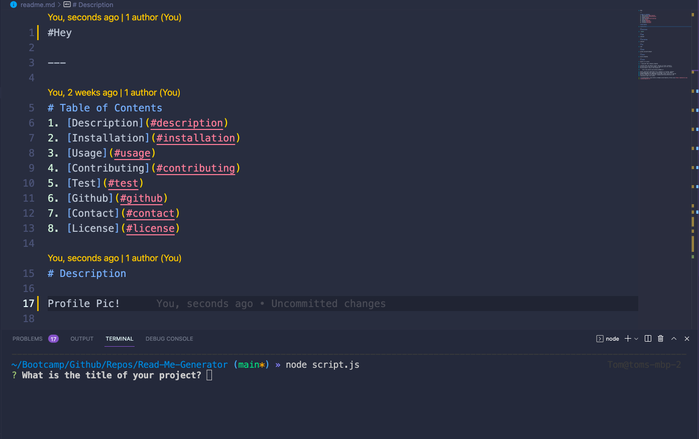
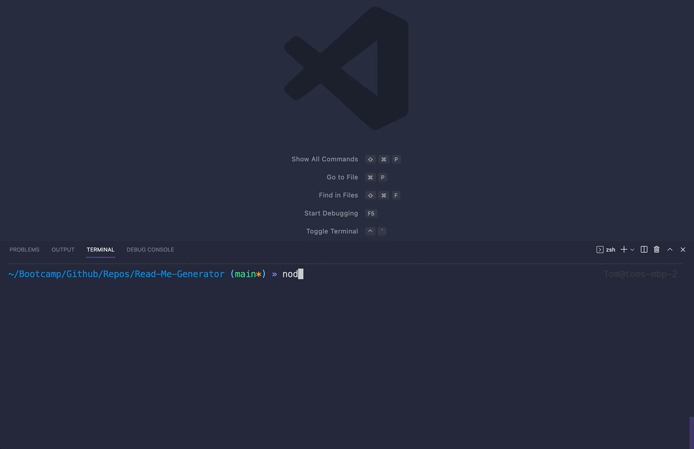

<div id="top"></div>
<div align="center">

[![Issues][issues-shield]][issues-url]
[![MIT License][license-shield]][license-url]
[![linkedin][linkedin-shield]][linkedin-url]

</div>
 <br />
 <br />

<div align="center">

</div>

<h1 align="center">Read Me Generator</h1>

  <p align="center">
    This application is a fully functioning ReadMe Generator. The generator allows a user to create a useful readme to attach to a project. Using npm inquirer a user can build out their readme with the CLI in the text editor or CLI of their choice. The project is easy to use, just install the relevant packages and you're good to go!
    <br />
    <a href="https://github.com/TomSouthwick/Read-Me-Generator"><strong>Explore the docs »</strong></a>
    <br />
    <br />
    ·
    <a href="https://youtu.be/F8t2dx_Sd-U">View Demo</a>
    ·
    <a href="https://github.com/TomSouthwick/Read-Me-Generator">Report Bug</a>
    ·
    <a href="https://github.com/TomSouthwick/Read-Me-Generator">Request Feature</a>
  </p>
</div>

 <br />
 <br />
<!-- TABLE OF CONTENTS -->
<h3/>
<b/>
<details>
  <summary>Table of Contents</summary>
  <ol>
    <li>
      <a href="#about-the-project">About The Project</a>
      <ul>
        <li><a href="#built-with">Built With</a></li>
      </ul>
    </li>
    <li>
      <a href="#getting-started">Getting Started</a>
      <ul>
        <li><a href="#prerequisites">Prerequisites</a></li>
        <li><a href="#installation">Installation</a></li>
      </ul>
    </li>
    <li><a href="#usage">Usage</a></li>
    <li><a href="#roadmap">Roadmap</a></li>
    <li><a href="#license">License</a></li>
    <li><a href="#contact">Contact</a></li>
    <li><a href="#acknowledgments">Acknowledgments</a></li>
  </ol>
</details>
</h3>
</b>
 <br />
 <br />

<!-- ABOUT THE PROJECT -->

## About The Project

 <br />


 <br />

This project is designed to demonstrate the inquirer package capabilities within a js app. The inquirer package prompts a user to enter information for their readme in the CLI. That information is then formatted into a markdown document and rendered as part of the project

<p align="right">(<a href="#top">back to top</a>)</p>

### Built With

- [Inquirer](https://www.npmjs.com/package/inquirer)
- [Javascript](https://www.javascript.com/)

<p align="right">(<a href="#top">back to top</a>)</p>

<!-- GETTING STARTED -->

## Getting Started

Clone the repo into a local folder. Open that folder in VS Code.

### Prerequisites

Ensure that VS Code has the required languages with the respective functionalities built in.

### Installation

1. Clone the repo
   ```sh
   git clone https://github.com/TomSouthwick/Read-Me-Generator.git
   ```
2. Install NPM packages
   ```sh
   npm install
   ```
3. Run the package
   ```sh
   node script.js
   ```

<p align="right">(<a href="#top">back to top</a>)</p>

<!-- USAGE EXAMPLES -->

## Usage

A user will be prompted to add their project title, description, dependencies, usage, contributions, testing, github, contact information and license. The resulting answers are rendered as markdown and styled as a html document.

_For more examples, please refer to the [Documentation](https://github.com/TomSouthwick/Read-Me-Generator)_

<p align="right">(<a href="#top">back to top</a>)</p>

<!-- ROADMAP -->

## Roadmap

- ✅ Created inquirer prompt
- ✅ Created questions
- ✅ formatted answers into a styled .md document
  - ✅ incorporated licenses, shields and relevant dates

See the [open issues](https://github.com/TomSouthwick/Read-Me-Generator/issues) for a full list of proposed features (and known issues).

<p align="right">(<a href="#top">back to top</a>)</p>

<!-- CONTRIBUTING -->

<!-- LICENSE -->

## License

Distributed under the MIT License. See `LICENSE.txt` for more information.

<p align="right">(<a href="#top">back to top</a>)</p>

<!-- CONTACT -->

## Contact

Tom Southwick - [Linkedin](https://linkedin.com/in/tomsouthwick)

Project Link: [https://github.com/TomSouthwick/Read-Me-Generator](https://github.com/TomSouthwick/Read-Me-Generator)

<p align="right">(<a href="#top">back to top</a>)</p>

<!-- ACKNOWLEDGMENTS -->

## Acknowledgments

- [ReadMe](https://github.com/othneildrew/Best-README-Template.git)

<p align="right">(<a href="#top">back to top</a>)</p>

<!-- MARKDOWN LINKS & IMAGES -->
<!-- https://www.markdownguide.org/basic-syntax/#reference-style-links -->

[issues-shield]: https://img.shields.io/github/issues/TomSouthwick/Read-Me-Generator.svg?style=for-the-badge
[issues-url]: https://github.com/TomSouthwick/Read-Me-Generator/issues
[license-shield]: https://img.shields.io/github/issues/TomSouthwick/Read-Me-Generator.svg?style=for-the-badge
[license-url]: https://github.com/TomSouthwick/Read-Me-Generator/blob/master/LICENSE.txt
[linkedin-shield]: https://img.shields.io/badge/-LinkedIn-black.svg?style=for-the-badge&logo=linkedin&colorB=555
[linkedin-url]: https://linkedin.com/in/tomsouthwick
[product-screenshot]: assets/pic1.png

https://github.com/TomSouthwick/Read-Me-Generator
